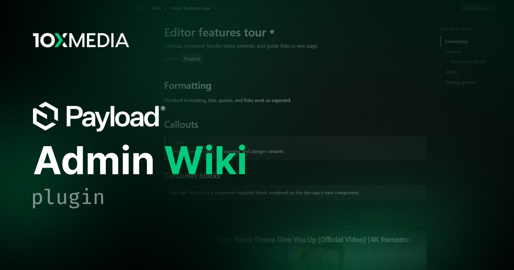

# @10x-media/admin-wiki

A living wiki inside the Payload v3 admin panel. Editors write guides as Payload documents, attach each one to the collections, globals, fields, and blocks it explains, and the admin renders it exactly there: under the field, inside the block, in the document sidebar, above the list table.

[](https://www.npmjs.com/package/@10x-media/admin-wiki)

Part of the [@10x-media Payload plugins](https://github.com/10x-media/payload-plugins) collection. In beta: published under the `beta` dist-tag until a stable 1.0.

## Features

- **Guides attached to surfaces**: one guide targets any number of collections, globals, field schema paths, and block slugs, plus any custom keys you declare for the screens your config does not describe. Collections, globals, and blocks are picked from what the plugin covers; targets are stored as plain strings, so a guide survives its surface being removed.
- **Scoped to what you document**: Payload's own bookkeeping collections are out of the wiki by default, and `exclude` takes out any other collection, global, or block, surfaces and target pickers alike.
- **Zero-footprint injection**: field help arrives as a `Description` component, block and document help as UI fields. No data, no database columns, nothing in your generated types, and an undocumented admin looks exactly as it did before.
- **One request per session**: a compact targets map resolves hundreds of field surfaces with a synchronous lookup. Guide content loads lazily and caches per guide and locale.
- **Write in place**: "write this guide" opens a create drawer with the target prefilled, behind a per-browser edit mode so the affordances stay out of the way until wanted.
- **A self-contained editor**: callouts, guide-to-guide links, scoped uploads, optional YouTube/Vimeo embeds, and your own blocks. It never inherits the project's rich text configuration.
- **A reading view** at `/admin/wiki`: featured cards, search, filtering by surface, and a table of contents on longer guides.
- **Markdown seeding**: `seedWiki()` writes guides idempotently by slug, converting GitHub alerts to callouts and resolving media and cross-guide references.
- **Orphan detection**: a banner lists every guide whose targets no longer resolve against the running config.
- **Localized content and typed translations** with per-key overrides via `@10x-media/admin-wiki/i18n`.

## Quick start

```bash
pnpm add @10x-media/admin-wiki
```

```ts
// payload.config.ts
import { buildConfig } from 'payload'
import { adminWiki } from '@10x-media/admin-wiki'

export default buildConfig({
  plugins: [
    // Register last: the walker documents the config as it stands when it runs.
    adminWiki({}),
  ],
})
```

Then run `payload generate:importmap`, create a **Wiki Page**, pick a collection under **Targets**, and publish. The guide appears in that collection's document sidebar and list view.

## Documentation

Full documentation at [docs.10xmedia.de](https://docs.10xmedia.de/admin-wiki):

- [Overview](https://docs.10xmedia.de/admin-wiki)
- [Quick start](https://docs.10xmedia.de/admin-wiki/quick-start)
- [Targeting](https://docs.10xmedia.de/admin-wiki/targets)
- [Surfaces](https://docs.10xmedia.de/admin-wiki/surfaces)
- [Authoring](https://docs.10xmedia.de/admin-wiki/authoring)
- [The wiki view](https://docs.10xmedia.de/admin-wiki/wiki-view)
- [Write affordances](https://docs.10xmedia.de/admin-wiki/write-affordances)
- [Seeding](https://docs.10xmedia.de/admin-wiki/seeding)
- [Customization](https://docs.10xmedia.de/admin-wiki/customization)
- [Configuration](https://docs.10xmedia.de/admin-wiki/configuration)
- [i18n](https://docs.10xmedia.de/admin-wiki/i18n)

## License

[MIT](./LICENSE). Copyright 10x Media GmbH.
