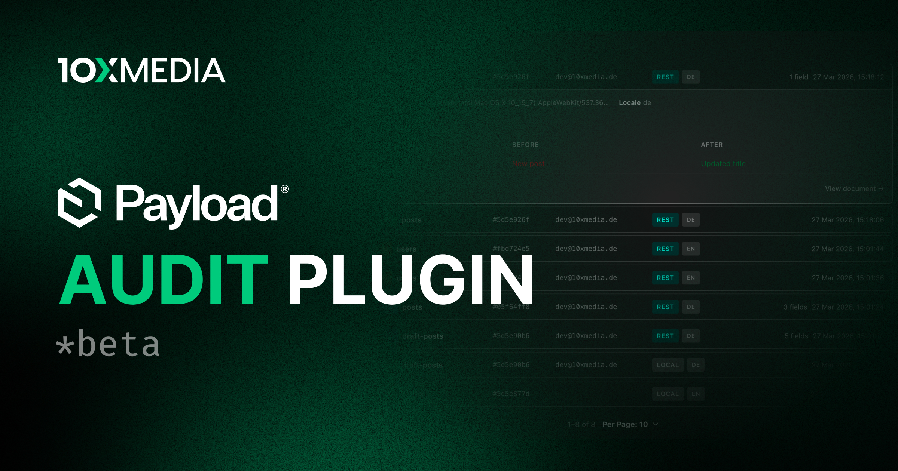

# @10x-media/audit-logs

Audit logging for Payload v3. Stamps `createdBy` and `lastModifiedBy` on the documents you choose, and records a separate entry with a field-level diff for every change, in a queryable collection with its own admin view.

[](https://www.npmjs.com/package/@10x-media/audit-logs)

Part of the [@10x-media Payload plugins](https://github.com/10x-media/payload-plugins) collection. In beta: published under the `beta` dist-tag until a stable 1.0.

## Features

- **A diff per change**, flat and dot-notated, so only what changed is stored. Array and blocks rows are keyed by row id, so a reorder is one `__order__` entry rather than a rewritten array.
- **Relationships normalized to ids** from the collection schema, so a populated hook payload never reads as a change.
- **`createdBy` / `lastModifiedBy`** as read-only relationship fields, added automatically or placed by hand inside a group or tab, polymorphic when you have several auth collections.
- **Auth events**: logins and password resets on every auth collection, whether or not it is otherwise audited.
- **Custom events** through `createAuditEvent`, for the things that matter but are not field changes.
- **Anonymization** per collection: keep the changed path, drop the value, in diffs and snapshots alike.
- **Snapshots** on create and delete, which is what makes a deleted document recoverable from its log entry.
- **Retention** through Payload's jobs queue: archive to gzipped CSV in an upload collection, then delete what was archived.
- **Multi-tenant aware**, with a tenant-scoped view alongside the global one, matching `@payloadcms/plugin-multi-tenant` defaults.
- **A browsable admin view** with filters on collection, global, operation, user, changed path, event type and date range, all held in the URL.
- **Typed reads**: `typedDiff<T>` and `typedSnapshot<T>` restore precise types to Payload's wide JSON fields.
- **Typed translations** with per-key overrides via `@10x-media/audit-logs/i18n`, shipping `en`, `de` and `uk`.

## Quick start

```bash
pnpm add @10x-media/audit-logs
```

```ts
// payload.config.ts
import { buildConfig } from 'payload'
import { auditLogs } from '@10x-media/audit-logs'

export default buildConfig({
  plugins: [
    auditLogs({
      collections: { posts: true },
    }),
  ],
})
```

Run `payload generate:importmap`, then open `/admin/audit-logs`.

Auditing is opt-*in*: nothing is recorded until you list it. `true` enables both the fields and the log; use an object for one or the other.

Every write to an audited collection writes a row, including writes from other plugins' hooks and from migrations. Configure [data retention](https://docs.10xmedia.de/audit-logs/data-retention) before enabling this on anything busy.

## Documentation

Full documentation at [docs.10xmedia.de](https://docs.10xmedia.de/audit-logs):

- [Overview](https://docs.10xmedia.de/audit-logs)
- [Quick start](https://docs.10xmedia.de/audit-logs/quick-start)
- [Configuration](https://docs.10xmedia.de/audit-logs/configuration)
- [What is logged](https://docs.10xmedia.de/audit-logs/what-is-logged)
- [Audit fields](https://docs.10xmedia.de/audit-logs/audit-fields)
- [Admin view](https://docs.10xmedia.de/audit-logs/admin-view)
- [Querying](https://docs.10xmedia.de/audit-logs/querying)
- [Anonymization](https://docs.10xmedia.de/audit-logs/anonymization)
- [Custom events](https://docs.10xmedia.de/audit-logs/custom-events)
- [Data retention](https://docs.10xmedia.de/audit-logs/data-retention)
- [Multi-tenancy](https://docs.10xmedia.de/audit-logs/multi-tenancy)
- [i18n](https://docs.10xmedia.de/audit-logs/i18n)

## License

[MIT](./LICENSE). Copyright 10x Media GmbH.
