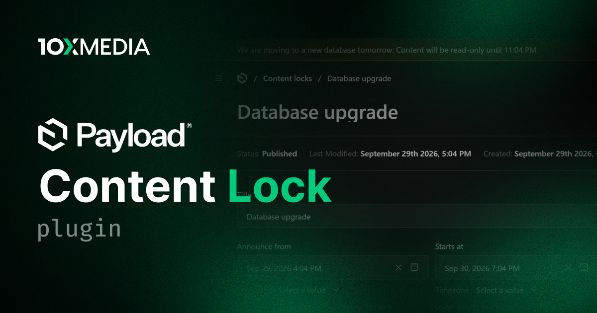

# @10x-media/content-lock

Planned and unplanned maintenance windows for Payload v3. While a window is active, every write to the frozen collections and globals is rejected with a 503 on every channel, the admin turns read-only, and a banner tells editors why and until when.

[](https://www.npmjs.com/package/@10x-media/content-lock)

Part of the [@10x-media Payload plugins](https://github.com/10x-media/payload-plugins) collection. In beta: published under the `beta` dist-tag until a stable 1.0.

## Features

- Lock windows as documents: start now or schedule ahead, announce in advance, end at a time or by hand, with drafts and time zones.
- Blocks writes on REST, GraphQL, the admin and the Local API, including `overrideAccess: true`, with `Retry-After`.
- Freeze everything, configured groups, or individual collections and globals; exempt what the public site writes to.
- An admin banner that pages through windows, with localized per-window messages and live lock value tokens.
- Works with `@10x-media/jobs`: full locks pause the queues, interrupted jobs fail cleanly or defer until the lock ends.
- Typed translations with per-key overrides via `@10x-media/content-lock/i18n`.

## Quick start

```bash
pnpm add @10x-media/content-lock
```

```ts
// payload.config.ts
import { buildConfig } from 'payload'
import { contentLock } from '@10x-media/content-lock'

export default buildConfig({
  plugins: [
    contentLock({
      groups: [{ key: 'catalog', label: 'Catalog', collections: ['products', 'categories'] }],
    }),
  ],
})
```

Then regenerate the import map, and on Postgres create a migration. Open **Content locks** in the admin and press **Lock now**.

## Documentation

Full documentation at [docs.10xmedia.de](https://docs.10xmedia.de/content-lock):

- [Overview](https://docs.10xmedia.de/content-lock)
- [Quick start](https://docs.10xmedia.de/content-lock/quick-start)
- [Windows](https://docs.10xmedia.de/content-lock/windows)
- [Scope](https://docs.10xmedia.de/content-lock/scope)
- [Enforcement](https://docs.10xmedia.de/content-lock/enforcement)
- [Banner](https://docs.10xmedia.de/content-lock/banner)
- [Jobs](https://docs.10xmedia.de/content-lock/jobs)
- [Configuration](https://docs.10xmedia.de/content-lock/configuration)
- [i18n](https://docs.10xmedia.de/content-lock/i18n)

## License

[MIT](./LICENSE). Copyright 10x Media GmbH.
