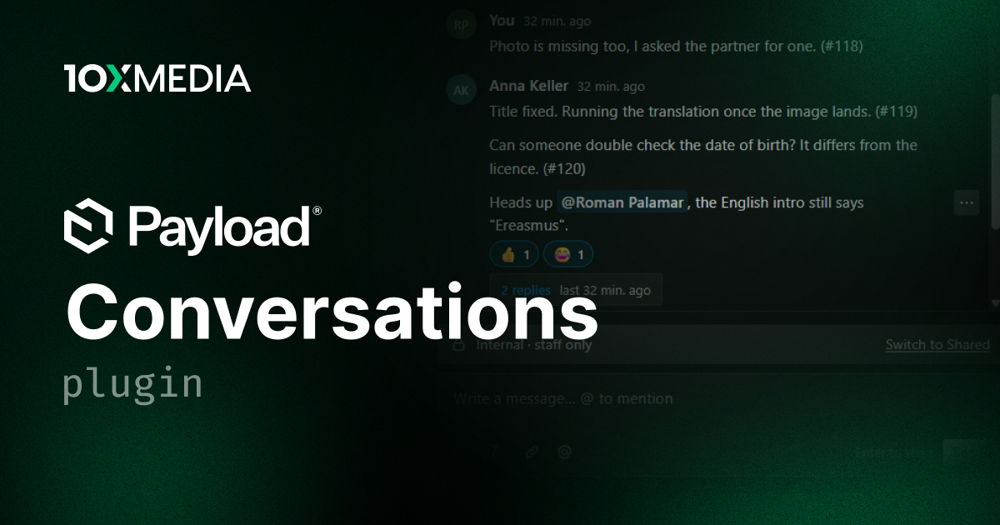

# @10x-media/conversations

Conversations for Payload: messages bound to any document, global or custom key, with channels that decide who reads what, one-level threads, mentions and per-user read state. Comments on documents, reactions and file attachments ship as extensions; support tickets, chat rooms and website chats are built from the same primitives.

[](https://www.npmjs.com/package/@10x-media/conversations)

Part of the [@10x-media Payload plugins](https://github.com/10x-media/payload-plugins) collection. In beta: published under the `beta` dist-tag until a stable 1.0.

## Features

- **Bound to targets, not to a conversations table**: a conversation is a key (`collection:persons:42`, `global:settings`, `custom:room:general`). The target document holds no reference to it.
- **Channels with their own access**: `internal` for staff, `shared` for the customer. A cue above the composer says who will read what you write, per viewer.
- **Access in one batch**: conversation access answers for many targets at once, with grants per target (every channel, some channels, or read only). Channel rules see only the user and run once per request. Both collections are closed over REST.
- **Threads** one level deep, with atomic reply counts on Mongo and Postgres.
- **Mentions** with a typeahead that offers only people who can read the channel; `afterMention` fires once per new mention, never again on edits.
- **Unread state** per user and channel, and per thread.
- **Transports**: polling by default (one tab per key, nothing while hidden, signed tokens so a tick runs no access code), Server-Sent Events served by Payload itself with database, Payload KV or Redis buses, or a Pusher-compatible service for serverless hosts.
- **Extensions**: `comments()` adds a Comments button to edit views, `reactions()` adds emoji reactions with per-person limits, `attachments()` adds files on messages through an upload collection of its own or yours. Your own extensions get per-message data, endpoints, stored fields, their part of a send, slots, composer addons and client data.
- **Admin UI on Payload's own components**: drawer, panel, feed, message, thread and a Lexical composer with a toolbar, `/` commands, markdown and links. Add to it through slots, or replace any of its components entirely.
- **Website UI**: headless React hooks and a composer core without `@payloadcms/ui`, plus shadcn registry components to start from.
- **Several instances**: call `conversations()` once per use case (`comments`, `tickets`, `chat`), each with its own collections, endpoints and transport.

## Quick start

```bash
pnpm add @10x-media/conversations@beta
```

```ts
// payload.config.ts
import { conversations, perTarget } from '@10x-media/conversations'
import { comments } from '@10x-media/conversations/comments'

const isStaff = ({ req }) => req.user?.collection === 'users'

export default buildConfig({
  plugins: [
    conversations({
      slug: 'comments',
      access: perTarget(({ req }) => Boolean(req.user)),
      channels: [
        {
          slug: 'internal',
          label: 'Internal',
          access: { read: isStaff, create: isStaff },
        },
      ],
      extensions: [comments({ collections: { posts: true } })],
    }),
  ],
})
```

Then run `payload generate:importmap`. Every edit view of `posts` now has a Comments button in its document controls.

## Documentation

Full documentation at [docs.10xmedia.de](https://docs.10xmedia.de/conversations):

- [Overview](https://docs.10xmedia.de/conversations) and [Quick start](https://docs.10xmedia.de/conversations/quick-start)
- [Concepts](https://docs.10xmedia.de/conversations/concepts), [Access](https://docs.10xmedia.de/conversations/access), [Messages](https://docs.10xmedia.de/conversations/messages), [Rich text](https://docs.10xmedia.de/conversations/rich-text)
- [Extensions](https://docs.10xmedia.de/conversations/extensions): comments, reactions, attachments, writing your own
- [Admin UI](https://docs.10xmedia.de/conversations/admin-ui): components, slots, replacing components, custom views, styling
- [Website UI](https://docs.10xmedia.de/conversations/website): the shadcn registry and the headless hooks
- [Transport](https://docs.10xmedia.de/conversations/transport): polling, SSE, Pusher
- [Recipes](https://docs.10xmedia.de/conversations/recipes/support-tickets): support tickets, chat rooms, multi-tenant
- [Configuration](https://docs.10xmedia.de/conversations/configuration) and [Production notes](https://docs.10xmedia.de/conversations/production)

## Development

```bash
pnpm dev conversations      # dev app on :3000, log in as dev@10xmedia.de / password
pnpm test conversations     # unit + integration (Mongo in memory)
pnpm test:matrix conversations
pnpm test:e2e conversations
```

The dev app shows every transport: comments on polling, `/admin/chat` on SSE, and tickets on Pusher through Soketi (`docker compose -f packages/conversations/docker-compose.dev.yml up -d`). The website under `/support` uses the registry components with a customer login (`customer@example.com` / `password`, in a private window).

## License

MIT
