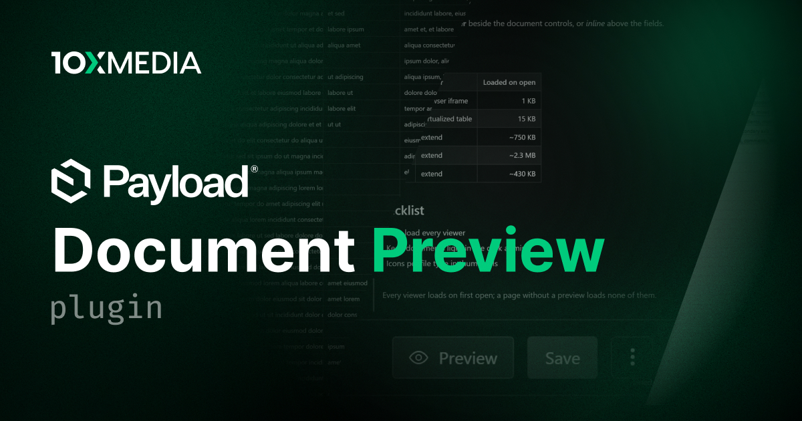

# @10x-media/document-preview

Read-only previews of upload documents in the Payload v3 admin. Images, video, audio, PDF, CSV, text and code, Markdown, Word, Excel and PowerPoint open in viewers styled like the admin, from a button beside the document controls, inline above the fields, or a list column. Everything renders in the browser and loads only when a file of its kind is opened.

[](https://www.npmjs.com/package/@10x-media/document-preview)

Part of the [@10x-media Payload plugins](https://github.com/10x-media/payload-plugins) collection. In beta: published under the `beta` dist-tag until a stable 1.0.

## Features

- **Every common format**: images with zoom and pan, native video and audio, PDF through the browser's viewer, CSV and TSV in a table virtualized on both axes, text and code in Payload's code editor, rendered Markdown with GFM tables.
- **Office documents in the browser**: Word with a page rail, Excel with formulas, a formula bar and sheet tabs, PowerPoint with a slide rail, through extend's WebAssembly renderers. No server conversion.
- **Three surfaces**: a drawer from the edit view, an inline preview above the fields, a Preview column in the list view; `DocumentPreview` and `PreviewDrawer` for your own components.
- **Lazy by format**: each viewer is its own chunk, fetched on first open. Pages that never open a preview load none of them.
- **Custom viewers**: replace the viewer for any mime type, per collection or globally, with your own component.
- **File-type icons** for non-image thumbnails across the admin, plus icons of your own, served to signed-in users only.
- **Readable file sizes** in the list view.
- Typed translations with per-key overrides via `@10x-media/document-preview/i18n`.

## Quick start

```bash
pnpm add @10x-media/document-preview@beta
```

```ts
// payload.config.ts
import { buildConfig } from 'payload'
import { documentPreview } from '@10x-media/document-preview'

export default buildConfig({
  // ...
  plugins: [
    documentPreview({
      collections: {
        media: { display: 'both', listView: true },
      },
    }),
  ],
})
```

Then regenerate the import map, open a document of the collection and press **Preview** beside **Save**.

## Documentation

Full documentation at [docs.10xmedia.de](https://docs.10xmedia.de/document-preview):

- [Overview](https://docs.10xmedia.de/document-preview)
- [Quick start](https://docs.10xmedia.de/document-preview/quick-start)
- [Surfaces](https://docs.10xmedia.de/document-preview/surfaces)
- [Viewers](https://docs.10xmedia.de/document-preview/viewers)
- [Custom viewers](https://docs.10xmedia.de/document-preview/custom-viewers)
- [File icons](https://docs.10xmedia.de/document-preview/file-icons)
- [Production](https://docs.10xmedia.de/document-preview/production)
- [Configuration](https://docs.10xmedia.de/document-preview/configuration)
- [i18n](https://docs.10xmedia.de/document-preview/i18n)

## License

[MIT](./LICENSE). Copyright 10x Media GmbH.
