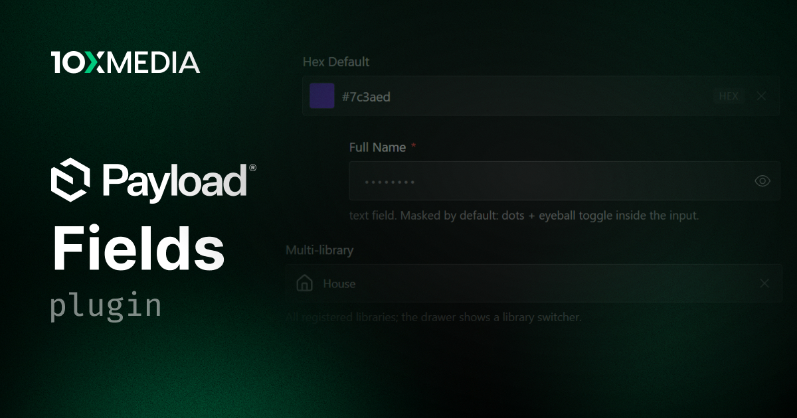

# @10x-media/fields

Reusable fields for Payload v3 that look and behave native: a full color picker in a constant-height row, a searchable icon picker over pluggable icon libraries, encrypted fields with key rotation and opt-in exact-match querying, and a unit-aware measurement field. Built from `@payloadcms/ui` primitives on Payload design tokens, indistinguishable from Payload's own fields.

[](https://www.npmjs.com/package/@10x-media/fields)

Part of the [@10x-media Payload plugins](https://github.com/10x-media/payload-plugins) collection. In beta: published under the `beta` dist-tag until a stable 1.0.

## Features

- **Color field**: saturation/hue/alpha picker, eyedropper, preset palettes (static or resolved from your data), any CSS color as input, one configured stored format (`hex`/`rgb`/`hsl`/`oklch`), and an opt-in linked mode that stores preset references so palette changes propagate everywhere.
- **Icon field**: drawer browser with search, category rail, and keyboard navigation; Lucide, Radix, and Tabler adapters first-party; `defineIconAdapter()` plus codegen for any other library; per-icon lazy loading so no icon dataset ever enters an eager bundle; client and RSC frontend renderers; library-supplied labels for sets keyed by code; and layered libraries composing a package with a Payload upload collection editors can add to, each layer declaring its own render strategy and caching.
- **Encrypted fields**: AES-256-GCM with authenticated field binding, for twelve field types including `richText` and `point`; zero-config keys derived from `PAYLOAD_SECRET` or explicit multi-key config with async providers and online rotation; opt-in blind-index querying (`equals`/`in`/`unique`); masked admin UX with reveal toggle.
- **Measurement field**: a plain `number` column storing one canonical unit while each admin edits and reads in their own preferred unit; eight ready-made presets (body weight, height, distance, mass, length, volume, temperature, speed) or free-form `storageUnit`/`units`/`preferenceKey` for anything else, plus serializable custom units and dimensions; per-bucket preference follows the editor across devices, falls back through field and plugin defaults to browser-locale detection, then metric; compound entry for feet-and-inches and stone-and-pounds; zero-migration adoption on existing numeric columns.
- **Native by construction**: 40px rows, Payload tokens, full `admin` prop contract, typed translations, function-form `overrides` on every factory.
- **Isolated bundles**: each family behind its own subpath export, isolation asserted on the built output in CI.
- **Plugin optional**: every factory works standalone; the `fields()` plugin adds app-wide defaults that per-field options override.

## Quick start

```bash
pnpm add @10x-media/fields
```

```ts
// collections/Brands.ts
import { colorField } from '@10x-media/fields/color'
import { iconField } from '@10x-media/fields/icon'
import { lucideAdapter } from '@10x-media/fields/icon/adapters/lucide'
import { encryptedField } from '@10x-media/fields/encrypted'

fields: [
  colorField({ name: 'primaryColor', required: true }),
  iconField({ name: 'icon', adapters: [lucideAdapter()] }),
  ...encryptedField({ name: 'apiToken', type: 'text' }),
]
```

Render stored icons on your frontend:

```tsx
import { createIcon } from '@10x-media/fields/icon/react'
import { lucideRenderer } from '@10x-media/fields/icon/adapters/lucide'

const Icon = createIcon({ adapters: [lucideRenderer()] })
// <Icon icon={doc.icon} size={20} />
```

## Documentation

Full documentation at [docs.10xmedia.de](https://docs.10xmedia.de/fields):

- [Overview](https://docs.10xmedia.de/fields)
- [Quick start](https://docs.10xmedia.de/fields/quick-start)
- [Color field](https://docs.10xmedia.de/fields/color)
- [Icon field](https://docs.10xmedia.de/fields/icon)
- [Encrypted fields](https://docs.10xmedia.de/fields/encrypted)
- [Key management](https://docs.10xmedia.de/fields/encrypted/key-management)
- [Measurement field](https://docs.10xmedia.de/fields/measurement)
- [Building your own](https://docs.10xmedia.de/fields/building-your-own)

## License

[MIT](./LICENSE). Copyright 10x Media GmbH.
